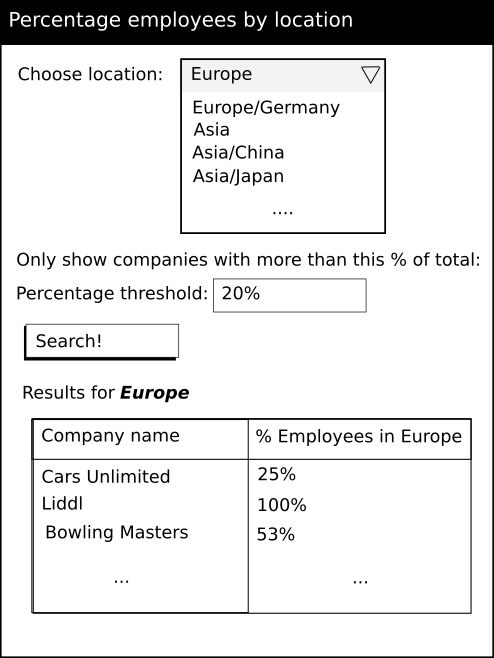

# Coding Exercise for Crunchr Front End Developer

## Problem Description

A client owns many companies with employees located over several
locations. The client wants to be able to view various statistics about
his companies and their employees over the different locations.

The goal of this exercise is to create a small website. However the most
important thing is that your code is readable, maintainable, scalable,
well structured, etc. Please use whichever tools / frameworks you
see fit.

## Requirements

The client would like to be able to have a list of all the companies
which have at least N% employees on a given location.

The user should be able to select the location from a dropdown, when
clicking "Search" a request should be performed to the appropriate
endpoint with this location id as a query parameter, and the results 
should be displayed.

If you have time you can provide the user with the ability to filter
the results based on a given percentage. This percentage should be
given to the backend when requesting and the filtering will be done
for you in the backend.



## The API

You are working as part of a full-stack team and another colleague has
already implemented the backend that will drive the page. They have
given you this implementation and api.yaml which specifies the API. In
order to run the API you will need python 3 installed...

```
python3 main.py
```

You should fill in the static directory with your front end
implementation.

## Time

As an indication we don't want you to spend more than 8 hours on the
task. Please mark down how much time you spend on the whole problem as
an indication for us.

If anything is unclear then please feel free to ask questions to clarify
the requirements.

Good Luck!!

## How to run the project
Clone the project repo from github.

Navigate to the project root folder. In a terminal window, run `python3 main.py`
Navigate to the folder `/static`. Run `npm install`. Run `ng serve`.

## Implementation explanations

### Technical choices

I chose to make the project in Angular to align to the company's front-end framework.
I opted for a very basic project, without angular-router, as the project was very simple.
I opted for TypeScript because I consider that interfaces offer a solid basis for standardization.
I chose CSS because I didn't really want to focus too much on styling.
The only extra that I considered was a web components library, and I went for Angular Material (due to being familiar with it from before).

### Time indication
* 2-4 hours: initial project set-up with Angular CLI, Service and interfaces coding, main components implementation (app component, dropdown and employees table).
* 4-6 hours: implementation of input for percentage with clearing option and of sorting (seemed logical to have a sorting)
* 6-8 hours: some styling and dynamic text + dynamic column for region name display

### Nice to have but out of scope
* Unit testing: tried to do it, but it seems I am not familiar with the initial configuration for Angular tests and Angular material was causing drama.

### Architecture
The app component is tying everything together, centralizing the inputs from its children (like the dropdown and the input) and being responsible for making the necessary calls to the service.

The only exception to this is the dropdown component, which is a bit "smarter", as it needs the locations info to render itself.

Here, it could be argued that the dropdown component should have received the locations list from the parent (and so be in line with the "dumb children, smart parent" structure,
but it seemed to go against the separation of concerns principle).

### Conclusions
It was a fun project, short and sweet. It was nice to work with Angular and TypeScript again.
Wish I had more time for unit testing and maybe organizing the styling a bit better.
